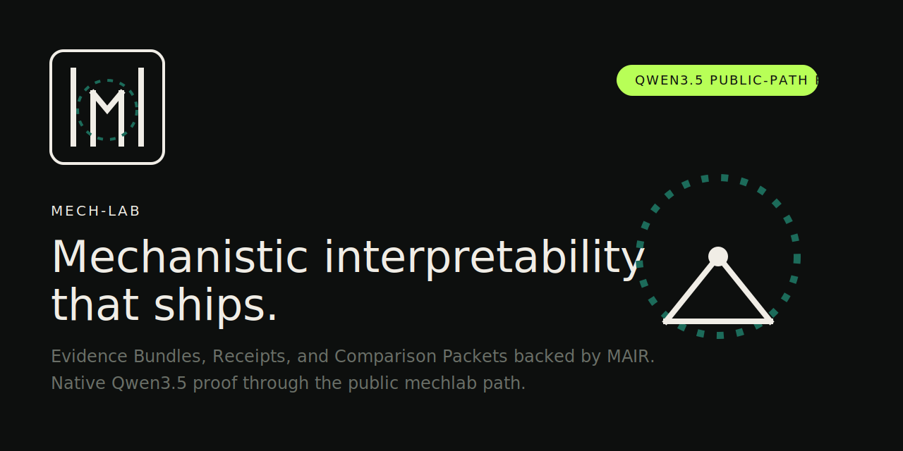

# mech-lab



> Mechanistic interpretability that ships.
>
> `Architecture-agnostic IR · Sheaf holonomy · SLSA L3 provenance`


`mech-lab` turns mechanistic analysis into Evidence Bundles, Receipts, and Comparison Packets that other engineers can verify offline. The proof path is public: the native Qwen3.5 lane runs through `mechlab` and emits MAIR-backed artifacts.

## Install

```bash
pip install mech-lab
```

While the release channel is still alpha-only, `pip install --pre mech-lab` is the explicit prerelease form.

From a source checkout, `mech-lab` auto-discovers the bundled `internal/blt` and `internal/mair` trees.

## 60-second quickstart

CLI:

```bash
mechlab demo --output-dir artifacts/mechlab-demo
mechlab report artifacts/mechlab-demo/mair_manifest.v1.json --kind release-summary
```

Python:

```python
import mech_lab as ml

bundle = ml.demo(output_dir="artifacts/mechlab-demo")
print(bundle.manifest_path)
print(ml.report(bundle))
```

## What You Get

- Evidence Bundle: `mair_manifest.v1.json` plus the required MAIR-backed run artifacts.
- Receipt: `assurance_receipt.v1.json` for release and replay decisions.
- Replay Pack: an analyzed MAIR bundle with hook validation and intervention outputs.
- Comparison Packet: `backend_comparison.v1.json` for run-to-run diffs.

The public surface stays MAIR-backed. `mech-lab` does not introduce a second disk schema.

## Real Model Proof

- The required Qwen MVP lane now runs through the public `mechlab` facade on the native `qwen3_5` runtime.
- The validated rerun used the real `Qwen/Qwen3.5-2B` checkpoint and emitted MAIR-backed artifacts.
- On the validated `16 GiB` arm64/MPS host, the successful public rerun used the documented CPU override after `device:auto` failed before artifact emission.
- Full runtime evidence, artifact paths, and follow-up notes live in the [Qwen3.5 validation report](docs/qwen35-validation-report.md).

Proof story:

- install: `pip install mech-lab`
- first artifact: `mechlab demo`
- real-model proof: native Qwen3.5 public-path rerun through `mechlab`
- trust anchor: MAIR-backed artifacts plus release assurance receipts

## How It Works

```text
mechlab CLI / mech_lab SDK
        |
        +-- internal/blt   trace capture, replay, analysis export
        |
        +-- internal/mair  manifest, validation, gating, artifact contract
        |
        +-- hybrid_mechlab compatibility and topology/runtime helpers
```

`mech-lab` is the only release-facing package. `BLT` and `MAIR` remain in-repo as internal subsystems, and `hybrid_mechlab` remains import-compatible during the transition without becoming the primary public identity.

## Docs And Status

- [CLI and API contract](docs/mvp-cli-api-contract.md)
- [Public object spec](docs/public-object-spec.md)
- [Qwen3.5 validation report](docs/qwen35-validation-report.md)
- [Release readiness checklist](docs/release-readiness.md)
- [Hybrid schedule spec](specs/hybrid_schedule_v1.md)
- [Sheaf connection spec](specs/sheaf_connection_v1.md)
- [Native core portfolio spec](specs/native_core_portfolio_v1.md)

Release status:

- Alpha release surface: one public package, `mech-lab`
- Public CLI: `mechlab`
- Public Python namespace: `mech_lab`
- Internal subsystem trees: `internal/blt` and `internal/mair`
- Legacy transition trees: `legacy/hybrid-mechlab-python` and `legacy/python-rust`

## Contributing

- [Developer architecture](docs/developer-architecture.md)
- [Internal subsystem map](docs/internal-subsystem-map.md)
- [Migration and compatibility notes](docs/migration-compatibility.md)
- [Brand system and launch kit](docs/brand/README.md)
- [Internal BLT notes](internal/blt/README.md)
- [Internal MAIR notes](internal/mair/README.md)

Generated caches and local build outputs are disposable. The tracked `src/*.egg-info` policy inside the imported BLT and MAIR histories remains deferred to a later packaging pass.
